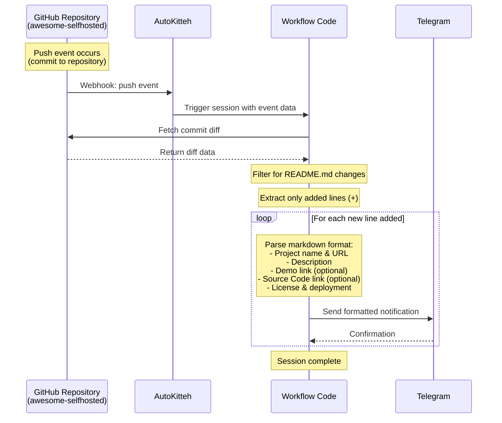

# Awesome Selfhosted Monitor

This AutoKitteh project monitors the [awesome-selfhosted](https://github.com/awesome-selfhosted/awesome-selfhosted/) GitHub repository for new software additions and sends formatted notifications to Telegram.

## Overview

The workflow automatically:

1. Detects push events to the awesome-selfhosted repository
2. Analyzes git diffs to identify new lines added to README.md
3. Parses the markdown format to extract project details
4. Sends formatted Telegram notifications for each newly added software entry

Only additions are processed - modifications and deletions are ignored.

## Features

- **Real-time monitoring**: Triggers on every push to the repository
- **Smart parsing**: Extracts project name, URL, description, demo link, source code link, license, and deployment method
- **Formatted notifications**: Sends clean, readable messages to Telegram
- **Selective processing**: Only processes new additions, ignoring edits and deletions

## Configuration

### Connections

You need to configure two connections:

#### 1. GitHub Connection (`github_conn`)

This connection monitors the awesome-selfhosted repository for push events.

**Setup:**

1. In the AutoKitteh UI, create a new GitHub connection named `github_conn`
2. Authenticate with your GitHub account
3. The connection will automatically receive webhook events from the repository

#### 2. Telegram Connection (`telegram_conn`)

This connection sends notifications to your Telegram channel or chat.

**Setup:**

1. Create a Telegram bot using [@BotFather](https://t.me/botfather)
2. Get your bot token
3. In the AutoKitteh UI, create a new Telegram connection named `telegram_conn`
4. Configure the bot token
5. **Important**: Update the `chat_id` in `program.py` (line 145) with your target channel or chat ID
   - For channels: Use `@channel_name` or the numeric channel ID
   - For private chats: Use the numeric chat ID
   - To find your chat ID, you can use [@userinfobot](https://t.me/userinfobot)

### Environment Variables

No additional environment variables are required. All configuration is done through connections.

## Deployment

1. Ensure you have the AutoKitteh CLI installed
2. Configure both connections as described above
3. Update the `chat_id` in `program.py` with your Telegram destination
4. Deploy the project:

```bash
ak deploy --manifest autokitteh.yaml
```

## Workflow Diagram



## Example Notification

When a new software entry is added, you'll receive a Telegram message like:

```
🆕 New Software Added to awesome-selfhosted

*ProjectName*
🔗 https://project-url.com

📝 A brief description of the project and its features.

🎮 Demo: https://demo.project-url.com
💻 Source: https://github.com/user/project
📜 License: `MIT`
🚀 Deployment: `Docker`
```

## How It Works

### 1. Event Detection

The workflow is triggered by GitHub push events filtered to only the `awesome-selfhosted/awesome-selfhosted` repository.

### 2. Commit Processing

For each commit in the push:

- Fetches the full commit details via GitHub API
- Checks if README.md was modified
- Extracts the git diff patch

### 3. Diff Analysis

- Parses the patch to find lines starting with `+` (additions)
- Filters out the `+++` header lines
- Processes only genuinely new content

### 4. Markdown Parsing

Uses regex patterns to extract:

- Project name and URL from `[Name](URL)` format
- Description text
- Optional demo link from `[Demo](URL)`
- Optional source code link from `[Source Code](URL)`
- License information from backticks
- Deployment method from backticks

### 5. Notification

Sends a formatted Markdown message to Telegram with all extracted information.

## Customization

### Modify Notification Format

Edit the `send_telegram_notification()` function in `program.py` to change the message format.

### Change Target Repository

Update the filter in `autokitteh.yaml`:

```yaml
filter: data.repository.full_name == "owner/repository"
```

### Add Additional Processing

You can extend the workflow to:

- Store entries in a database
- Send notifications to multiple channels
- Filter by specific categories or tags
- Perform additional validation

## Troubleshooting

### No notifications received

- Verify the GitHub connection is active and receiving events
- Check that the `chat_id` in `program.py` is correct
- Review the AutoKitteh session logs for errors

### Parsing errors

- The markdown format in awesome-selfhosted may vary
- Check the session logs to see which lines failed to parse
- Adjust the regex patterns in `parse_markdown_entry()` if needed

### Missing information in notifications

- Some entries may not include all optional fields (demo, source, etc.)
- The parser handles missing fields gracefully by showing only available information

## License

This project is provided as-is for use with AutoKitteh.
